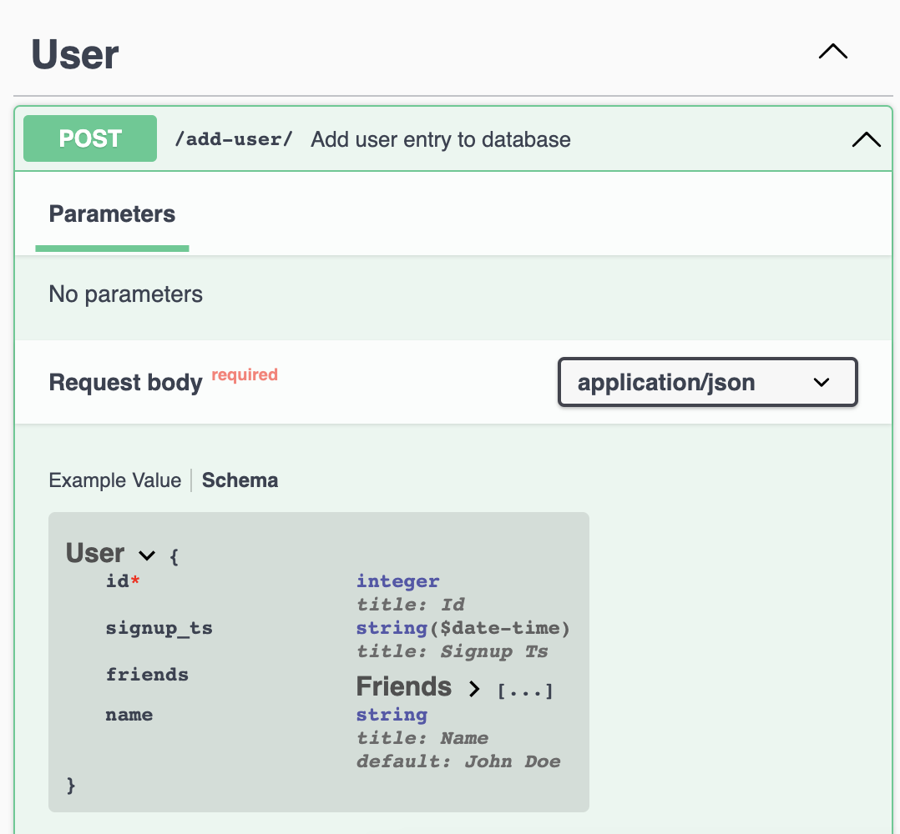

# example-pydantic-swagger

Convert pydantic definition to swagger docs

## Usage
```bash
# get schema from projectA
$ pipenv run python 01_generate_schema_a.py

# get schema from projectB
$ pipenv run python 01_generate_schema_b.py

# generate OpenAPI JSON
$ pipenv run python 02_generate_openapi.py

# spin up swagger ui
$ docker-compose up
```

Access via http://localhost:8080

## Screenshots




## References
- https://github.com/swagger-api/swagger-ui/blob/master/docs/usage/installation.md
